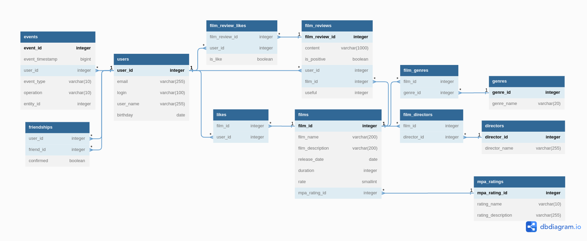

[English](..%2FREADME.md)

# Filmorate

---

#### *_Бэкенд для сервиса, который работает с фильмами и их оценками от пользователей, а также возвращает топ-5 фильмов, рекомендованных к просмотру_* 

---
Фильмов слишком много и их количество увеличивается с каждым днем!
Это приложение поможет каждому сделать правильный выбор, какой фильм посмотреть, на основе лайков пользователя.

---

Это приложение имеет функциональность:

1. Возможность хранения основной информации о пользователях и фильмах;
2. Возможность взаимодействия между пользователями: 
- добавление/удаление в/из списка друзей; 
- получение списка всех друзей пользователя; 
- получение списка всех общих друзей между двумя пользователями.
3. Возможность работы с информацией о фильмах внутри приложения: 
- добавление/удаление/обновление информации о фильме в базе данных;
- получение списка всех сохраненных фильмов; 
- добавление/удаление лайка к/из фильма; 
- получение списка самых популярных фильмов.
4. Информация о режиссёрах:
- вывод всех фильмов режиссёра, отсортированных по количеству лайков;
- вывод всех фильмов режиссёра, отсортированных по годам;
- вывод списка всех режиссёров;
- получение режиссёра по id;
- создание данных о режиссёре;
- изменение данных о режиссёре.
5. Работа с отзывами пользователей:
- добавление нового отзыва;
- редактирование уже имеющегося отзыва;
- удаление уже имеющегося отзыва;
- получение отзыва по идентификатору;
- получение всех отзывов по id фильма (если не указан то все). Если кол-во не указано, то 10;
- возможность поставить и удалить лайк/дизлайк отзыву.
6. Добавлена возможность просмотра последних событий на платформе — добавление в друзья, удаление из друзей, лайки и отзывы, которые оставили друзья пользователя.
7. Реализована простая рекомендательная система для фильмов (на основе лайков/оценок фильмов).
8. Реализован вывод общих с другом фильмов с сортировкой по их популярности.
9. Реализована возможность выводить топ-N фильмов по количеству лайков с фильтрацией по двум параметрам:
- по жанру;
- за указанный год.
10. Реализован поиск по названию фильмов и по режиссёру по подстроке.
---
Приложение основано на фреймворке Spring Boot v. 2.7.9;
Система сборки - Apache Maven;
База данных - h2;
Обращение к БД и мэппинг сущностей - spring-boot-starter-data-jdbc;
Тестирование - JUnit;

---

Инструкция по запуску приложения локально:
1. Для запуска приложения необходимо программное обеспечение
- Git (вариант гайда по установке - https://learn.microsoft.com/ru-ru/devops/develop/git/install-and-set-up-git);
- JDK (java SE11+, вариант гайда по установке - https://blog.sf.education/ustanovka-jdk-poshagovaya-instrukciya-dlya-novichkov/);
- Apache Maven (вариант гайда по установке на Windows - https://byanr.com/installation-guides/maven-windows-11/).
2. Запустить терминал/командную строку/PowerShell, выполнить поочерёдно команды, дождавшись завершения каждой:
```
cd {целевая директория для загрузки проекта}

git clone git@github.com:RuslanYapparov/java-filmorate.git

mvn package

cd target

java -jar filmorate-0.0.1-SNAPSHOT.jar

```
3. После запуска приложение будет принимать http-запросы в соответствии с API (см. ниже) на порту 8080 (http://localhost:8080/).
4. Для запуска тестового сценария можно воспользоваться коллекцией тестов (см. ниже).
---

Описание API (OpenAPI):

[filmorate_api(openapi).json](filmorate_api%28openapi%29.json)

для просмотра необходимо скопировать и открыть содержимое в Swagger editor

---

Коллекция тестов Postman:

[filmorate.postman_collection.json](filmorate.postman_collection.json)

импортировать коллекцию, скопировав содержимое в поле как Raw-текст

---

База данных приложения спроектирована в соответствии с ER-диаграммой (создана с помощью dbdiagram.io):



---

В разработке приложения принимали участие:
- SergeevViktor
- Sergeyvot
- DenchicK-64
- Rass00032

---

Приложение написано на языке Java. Пример кода:
```java
public class Filmorate {
    public static void main(String[] args) {
        System.out.println("Let's start liking films!");
    }
}
```
